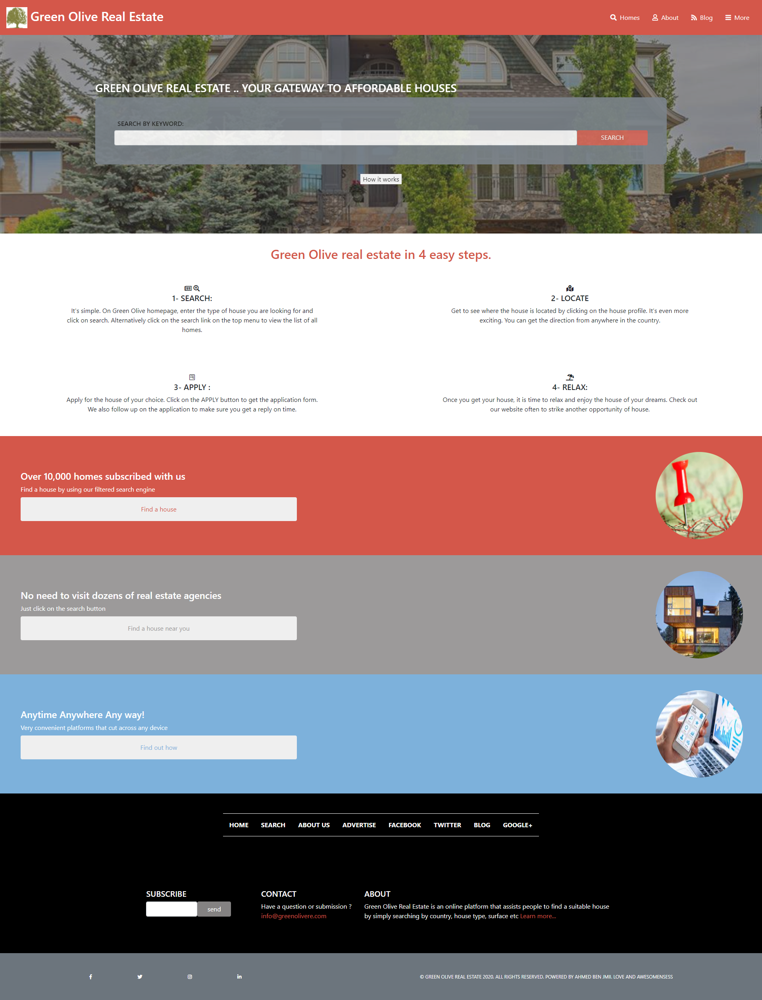

# Capstone-HTML-CSS-Library-Of-Houses

> This project consists on using bootstrap to create a responsive website design promoting for real estate homes for sale.

> The website design will have 3 pages : Main page || Search Results Page || Details Page

#### Techniques used for this build :

bootstrap
grid
flex
background images
gradient
media queries
google maps API

## Built With

- Bootstrap
- HTML
- CSS

## Live Demo

- [Live Demo Link](https://youthful-carson-6beb2b.netlify.app/)

#### Prerequisites

- Browser
- Internet

#### Get a local copy

1) Download the repository as zip file OR git clone "link-of-clone" to your local drive
2) Open the index.html file inside the webbrowser
3) To navigate to the search page : Click on the search button
4) To Check more details on the homes in the search page : Click on more info link

## Authors

👤 **Ahmed Ben Jmii**

- Github [@githubhandle](https://github.com/Ahmed-Benj)
- Linkedin [linkedin](https://www.linkedin.com/in/ahmed-b-05600992/)

## 🤝 Contributing

Contributions, issues and feature requests are welcome!

Feel free to check them https://github.com/Ahmed-Benj/Capstone-HTML-CSS-Library-Of-Houses/issues.

## Show your support

Give a ⭐️ if you like this project!
